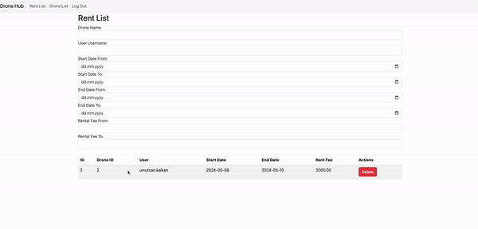

# DroneHub

DroneHub, drone kiralama işlevlerini sağlayan bir web uygulamasıdır. Bu uygulama, drone kiralama, izleme ve yönetim süreçlerini kolaylaştırmak için tasarlanmıştır.

## Başlarken

DroneHub projesinin backend'i django ile yazıldı. Frontend için ise React kullanıldı. React projesinde async işlemlerden dolayı işlem başarılı olsa dahi local storage'dan okunamadığı olabiliyor bu durumlar (login gibi) sayfayı yenilemenizi öneriyorum.

### Önkoşullar

Bu projeyi local olarak çalıştırabilmek için aşağıdaki araçların kurulu olması gerekmektedir:

- PostgreSQL
- Docker Desktop

### Kurulum

Docker db kurulumda sorun yaşadığım için database kurulumu localinizde kendinizin oluşturması gerekmektedir. Bir .env dosyası oluşturarak bilgilerini girmenin durumunda ayağa kalkan backend servisi database'e erişecektir. Docker compose ayağa kalktıktan sonra migrate çalışması gerekmektedir. İlgili komutları iletiyorum ama daha kolay gelen bir yol ile de yapabilirsiniz.

#### Veritabanı Oluşturma

1. PostgreSQL kurulu değilse, [buradan](https://www.postgresql.org/download/) indirip kurun.
2. Aşağıdaki SQL komutları ile bir veritabanı oluşturun:

   ```sql
   CREATE DATABASE dronehubdb;
   CREATE USER myuser WITH ENCRYPTED PASSWORD 'mypassword';
   GRANT ALL PRIVILEGES ON DATABASE dronehubdb TO myuser;

#### Environment Dosyası Oluşturma

Projede kullanılan database değerlerini içeren bir .env dosyası oluşturun:

1. [ ] `DB_NAME=dronehubdb
2. [ ] DB_USER=myuser
3. [ ] DB_PASSWORD=mypassword
4. [ ] DB_HOST=localhost
5. [ ] DB_PORT=5432`

#### Docker'ın Kurulması ve Çalıştırılması

Docker Desktop'ı [buradan](https://www.docker.com/products/docker-desktop/) indirip kurun. Proje dizinine gidin ve aşağıdaki komutu çalıştırın:

`docker-compose up --build
`
#### Migrasyonların Çalıştırılması

`docker exec -it <django_container_id> bash
python manage.py migrate`

### Kullanım

Ayağa kalkan react projesine register olarak ya da django projesinden superuser yaratarak giriş yapabilirsiniz. Loginden sonra sayfayı yenilemeniz gerekmektedir. Her kullanıcı Drone ekleyebilir ve kiralayabilir. Kullanıcılar sadece kendi kiraları görebilir ancak superuser iseniz her kiraya müdahale edebilirsiniz. Kiralama sırasında droneların uygunluğu kontrol edilmemektedir.

NOT: Rentlerin edit seçeneği row'a tıklanarak açılmaktadır Dronelar için ise buton bulunmaktadır.

